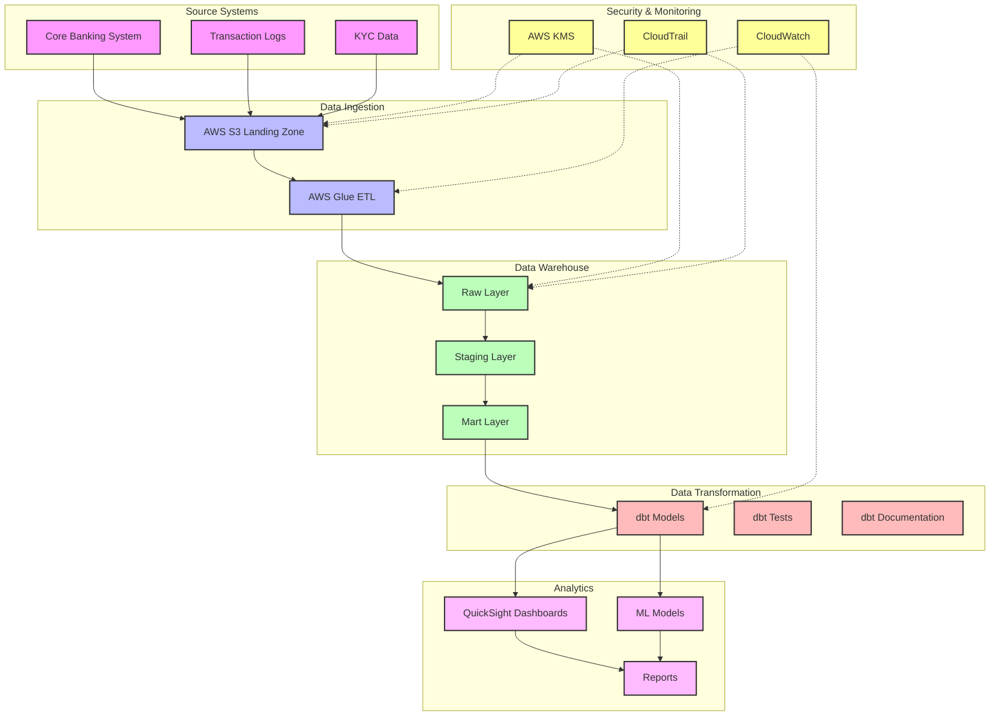

# FinTech Analytics Accelerator

Author: Dilliraja Sundar

A comprehensive analytics solution built with dbt, Amazon Redshift, and Amazon QuickSight for financial institutions to gain insights from their banking data.

## 🎯 Use Cases

- **Fraud Detection**: Identify suspicious activities through transaction patterns, login attempts, and geographic anomalies
- **Customer Segmentation**: Analyze customer behavior, demographics, and transaction patterns
- **Revenue Analysis**: Track interchange fees, loan interest, and other revenue streams
- **Customer Engagement**: Monitor churn risk and engagement metrics

## 🏗️ Architecture

The FinTech Analytics Accelerator follows a modern data stack architecture with the following components:



For detailed architecture documentation, see [Architecture.md](docs/architecture.md)

### Key Components

1. **Data Sources**
   - Core Banking System
   - Transaction Logs
   - KYC Data

2. **Data Pipeline**
   - AWS S3 Landing Zone
   - AWS Glue ETL
   - dbt Transformations

3. **Data Warehouse**
   - Amazon Redshift
   - Staging Models
   - Mart Models

4. **Analytics**
   - QuickSight Dashboards
   - ML Models
   - Reporting

## 🛠️ Tech Stack

- **dbt**: Data transformation and modeling
- **Amazon Redshift**: Data warehouse
- **Amazon QuickSight**: Visualization and dashboards

## 📊 Data Models

### Core Tables
- `customers`: Customer profiles and KYC data
- `accounts`: Account information and balances
- `transactions`: Transaction records
- `login_activity`: Authentication attempts
- `credit_scores`: Credit scoring data

### Analytics Models
- Transaction trends by customer segment
- Fraud detection indicators
- Revenue analysis
- Customer engagement metrics

## 🚀 Getting Started

### Prerequisites

1. **Required Software**
   - Python 3.8+
   - Git
   - AWS CLI configured with appropriate credentials
   - dbt CLI
   - Access to an Amazon Redshift cluster
   - Amazon QuickSight account
   - psql (PostgreSQL client) for Redshift connection

2. **AWS Resources Required**
   - Amazon Redshift cluster
   - Amazon S3 bucket
   - AWS Glue ETL jobs
   - Amazon QuickSight subscription
   - Appropriate IAM roles and permissions

### Deployment Steps

1. **Initial Setup**
   ```bash
   # Clone the repository
   git clone [repository-url]
   cd fintech-analytics-accelerator
   
   # Create and activate virtual environment
   python -m venv venv
   source venv/bin/activate  # On Windows: venv\Scripts\activate
   
   # Install dependencies
   pip install -r requirements.txt
   ```

2. **AWS Configuration**
   ```bash
   # Configure AWS CLI
   aws configure
   # Enter your AWS Access Key ID
   # Enter your AWS Secret Access Key
   # Enter your default region (e.g., us-east-1)
   # Enter your output format (json)
   ```

3. **Create Required AWS Resources**
   ```bash
   # Create S3 bucket
   aws s3 mb s3://your-fintech-bucket-name
   
   # Upload Glue ETL script
   aws s3 cp aws/glue/etl_job.py s3://your-fintech-bucket-name/glue/
   
   # Deploy CloudFormation stack
   aws cloudformation deploy \
     --template-file aws/cloudformation/glue-job.yaml \
     --stack-name fintech-etl \
     --parameter-overrides \
       Environment=dev \
       S3BucketName=your-fintech-bucket-name \
       RedshiftClusterIdentifier=your-cluster-id
   ```

4. **Redshift Setup**
   ```bash
   # Connect to Redshift and run setup script
   psql -h your-redshift-cluster.xxxxx.region.redshift.amazonaws.com \
        -U admin \
        -d fintech_db \
        -f aws/redshift/setup.sql
   
   # Set up maintenance schedule (optional)
   # Add to crontab:
   0 0 * * * psql -h your-redshift-cluster.xxxxx.region.redshift.amazonaws.com \
                  -U admin \
                  -d fintech_db \
                  -f aws/redshift/maintenance.sql
   ```

5. **Configure Environment Variables**
   ```bash
   # Copy the template file
   cp .env.template .env
   
   # Edit .env with your configuration
   REDSHIFT_HOST=your-redshift-cluster.xxxxx.region.redshift.amazonaws.com
   REDSHIFT_USER=admin
   REDSHIFT_PASSWORD=your-secure-password
   REDSHIFT_DATABASE=fintech_db
   AWS_PROFILE=default
   AWS_REGION=us-east-1
   S3_BUCKET=your-fintech-bucket-name
   ```

6. **Setup dbt**
   ```bash
   # Install dbt dependencies
   cd dbt
   dbt deps
   
   # Run initial models
   dbt seed  # Load seed data
   dbt run   # Run all models
   dbt test  # Run tests
   ```

7. **Verify Deployment**
   ```bash
   # Check Glue job status
   aws glue get-job --job-name fintech-etl-dev
   
   # Check Redshift tables
   psql -h your-redshift-cluster.xxxxx.region.redshift.amazonaws.com \
        -U admin \
        -d fintech_db \
        -c "\dt raw.*"
   
   # Check dbt models
   dbt test
   ```

### Common Issues and Solutions

1. **AWS Authentication Issues**
   - Verify AWS credentials are properly configured
   - Check IAM roles and permissions
   - Ensure AWS CLI is properly installed and configured

2. **Redshift Connection Issues**
   - Verify network connectivity to Redshift cluster
   - Check security group settings
   - Ensure correct credentials in .env file

3. **Glue Job Failures**
   - Check CloudWatch logs for error messages
   - Verify S3 bucket permissions
   - Ensure Redshift connection is properly configured

4. **dbt Model Errors**
   - Check model SQL syntax
   - Verify database permissions
   - Review dbt logs for specific errors

### Monitoring and Maintenance

1. **Regular Maintenance**
   - Run Redshift maintenance script daily
   - Monitor CloudWatch metrics
   - Check dbt test results

2. **Performance Monitoring**
   - Monitor Redshift query performance
   - Check Glue job execution times
   - Review QuickSight dashboard load times

3. **Security Updates**
   - Regularly rotate credentials
   - Update IAM policies as needed
   - Monitor CloudTrail logs

## 📊 Analytics Dashboards

1. **Fraud Detection Dashboard**
   - Suspicious transaction patterns
   - Login attempt anomalies
   - Geographic risk indicators

2. **Customer Analytics Dashboard**
   - Segmentation analysis
   - Engagement metrics
   - Churn risk indicators

3. **Revenue Dashboard**
   - Fee analysis
   - Product performance
   - Revenue trends

## 🔒 Security & Compliance

- Data encryption at rest and in transit
- Role-based access control
- Audit logging
- Compliance reporting

## 📈 Performance & Optimization

- Optimized Redshift configurations
- Efficient dbt models
- Cached QuickSight datasets
- Automated maintenance

