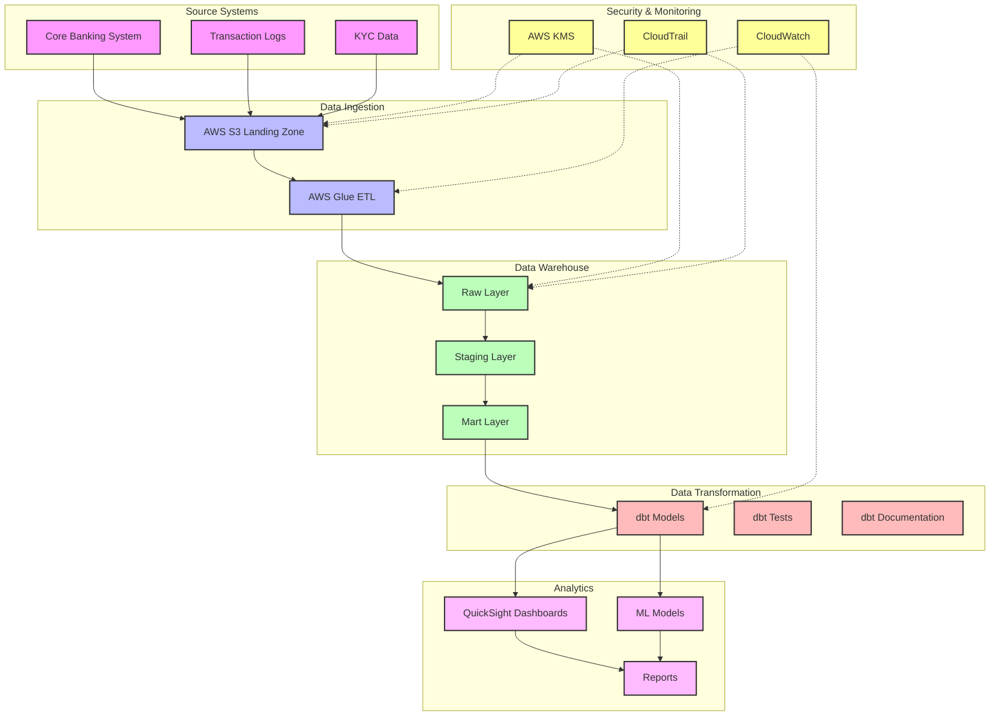

# FinTech Analytics Accelerator

A comprehensive analytics solution built with dbt, Amazon Redshift, and Amazon QuickSight for financial institutions to gain insights from their banking data.

## 🎯 Use Cases

- **Fraud Detection**: Identify suspicious activities through transaction patterns, login attempts, and geographic anomalies
- **Customer Segmentation**: Analyze customer behavior, demographics, and transaction patterns
- **Revenue Analysis**: Track interchange fees, loan interest, and other revenue streams
- **Customer Engagement**: Monitor churn risk and engagement metrics

## 🏗️ Architecture

The FinTech Analytics Accelerator follows a modern data stack architecture with the following components:



For detailed architecture documentation, see [Architecture.md](docs/architecture.md)

### Key Components

1. **Data Sources**
   - Core Banking System
   - Transaction Logs
   - KYC Data

2. **Data Pipeline**
   - AWS S3 Landing Zone
   - AWS Glue ETL
   - dbt Transformations

3. **Data Warehouse**
   - Amazon Redshift
   - Staging Models
   - Mart Models

4. **Analytics**
   - QuickSight Dashboards
   - ML Models
   - Reporting

## 🛠️ Tech Stack

- **dbt**: Data transformation and modeling
- **Amazon Redshift**: Data warehouse
- **Amazon QuickSight**: Visualization and dashboards

## 📊 Data Models

### Core Tables
- `customers`: Customer profiles and KYC data
- `accounts`: Account information and balances
- `transactions`: Transaction records
- `login_activity`: Authentication attempts
- `credit_scores`: Credit scoring data

### Analytics Models
- Transaction trends by customer segment
- Fraud detection indicators
- Revenue analysis
- Customer engagement metrics

## 🚀 Getting Started

1. **Prerequisites**
   - Python 3.8+
   - dbt CLI
   - Amazon Redshift cluster
   - Amazon QuickSight account

2. **Setup**
   ```bash
   # Clone the repository
   git clone [repository-url]
   
   # Install dependencies
   pip install -r requirements.txt
   
   # Configure dbt
   dbt deps
   dbt seed
   dbt run
   ```

3. **Development**
   - Create new models in `dbt/models/`
   - Add tests in `dbt/tests/`
   - Update documentation in `docs/`

## 📈 Analytics Dashboards

1. **Fraud Detection Dashboard**
   - Suspicious transaction patterns
   - Login attempt anomalies
   - Geographic risk indicators

2. **Customer Analytics Dashboard**
   - Segmentation analysis
   - Engagement metrics
   - Churn risk indicators

3. **Revenue Dashboard**
   - Fee analysis
   - Product performance
   - Revenue trends

## 🔒 Security & Compliance

- Data encryption at rest and in transit
- Role-based access control
- Audit logging
- Compliance reporting

## 📈 Performance & Optimization

- Optimized Redshift configurations
- Efficient dbt models
- Cached QuickSight datasets
- Automated maintenance