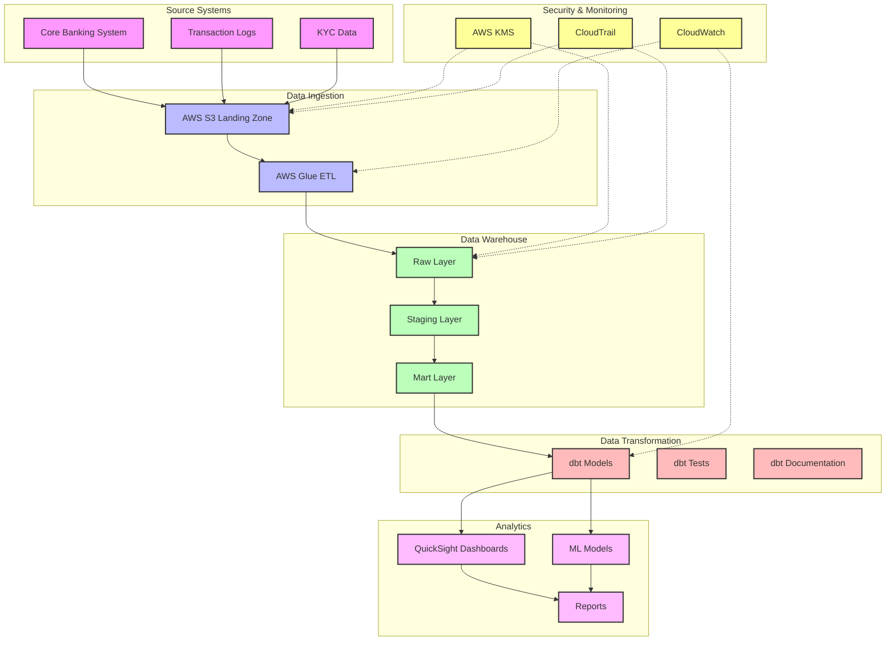

# FinTech Analytics Accelerator

A comprehensive analytics solution built with dbt, Amazon Redshift, and Amazon QuickSight for financial institutions to gain insights from their banking data.

## 🎯 Use Cases

- **Fraud Detection**: Identify suspicious activities through transaction patterns, login attempts, and geographic anomalies
- **Customer Segmentation**: Analyze customer behavior, demographics, and transaction patterns
- **Revenue Analysis**: Track interchange fees, loan interest, and other revenue streams
- **Customer Engagement**: Monitor churn risk and engagement metrics

## 🏗️ Architecture

The FinTech Analytics Accelerator follows a modern data stack architecture with the following components:



For detailed architecture documentation, see [Architecture.md](docs/architecture.md)

### Key Components

1. **Data Sources**
   - Core Banking System
   - Transaction Logs
   - KYC Data

2. **Data Pipeline**
   - AWS S3 Landing Zone
   - AWS Glue ETL
   - dbt Transformations

3. **Data Warehouse**
   - Amazon Redshift
   - Staging Models
   - Mart Models

4. **Analytics**
   - QuickSight Dashboards
   - ML Models
   - Reporting

## 🛠️ Tech Stack

- **dbt**: Data transformation and modeling
- **Amazon Redshift**: Data warehouse
- **Amazon QuickSight**: Visualization and dashboards

## 📊 Data Models

### Core Tables
- `customers`: Customer profiles and KYC data
- `accounts`: Account information and balances
- `transactions`: Transaction records
- `login_activity`: Authentication attempts
- `credit_scores`: Credit scoring data

### Analytics Models
- Transaction trends by customer segment
- Fraud detection indicators
- Revenue analysis
- Customer engagement metrics

## 🚀 Getting Started

### Prerequisites

1. **Required Software**
   - Python 3.8+
   - Git
   - AWS CLI configured with appropriate credentials
   - dbt CLI
   - Access to an Amazon Redshift cluster
   - Amazon QuickSight account

2. **AWS Resources Required**
   - Amazon Redshift cluster
   - Amazon S3 bucket
   - AWS Glue ETL jobs
   - Amazon QuickSight subscription
   - Appropriate IAM roles and permissions

### Detailed Setup Instructions

1. **Clone and Setup Project**
   ```bash
   # Clone the repository
   git clone [repository-url]
   cd fintech-analytics-accelerator
   
   # Create and activate virtual environment
   python -m venv venv
   source venv/bin/activate  # On Windows: venv\Scripts\activate
   
   # Install dependencies
   pip install -r requirements.txt
   ```

2. **Configure Environment Variables**
   ```bash
   # Copy the template file
   cp .env.template .env
   
   # Edit .env with your configuration
   # Required variables:
   # - REDSHIFT_HOST
   # - REDSHIFT_USER
   # - REDSHIFT_PASSWORD
   # - REDSHIFT_DATABASE
   # - AWS_PROFILE
   # - AWS_REGION
   ```

3. **Setup dbt**
   ```bash
   # Install dbt dependencies
   cd dbt
   dbt deps
   
   # Run initial models
   dbt seed  # Load seed data
   dbt run   # Run all models
   dbt test  # Run tests
   ```

4. **AWS Setup**
   - Create an S3 bucket for data landing
   - Set up AWS Glue ETL jobs
   - Configure Redshift cluster
   - Set up QuickSight

5. **Project Structure**
   ```
   fintech-analytics-accelerator/
   ├── dbt/
   │   ├── models/
   │   │   ├── staging/
   │   │   ├── intermediate/
   │   │   └── marts/
   │   ├── tests/
   │   ├── macros/
   │   ├── seeds/
   │   └── snapshots/
   ├── docs/
   ├── quicksight_assets/
   ├── requirements.txt
   ├── .env.template
   └── README.md
   ```

6. **Development Workflow**
   - Create new models in `dbt/models/`
   - Add tests in `dbt/tests/`
   - Update documentation in `docs/`
   - Use `dbt run` to test changes
   - Use `dbt test` to validate data quality

### Common Issues and Solutions

1. **dbt Connection Issues**
   - Verify Redshift credentials in `.env`
   - Check network connectivity to Redshift
   - Ensure IAM roles are properly configured

2. **AWS Authentication**
   - Verify AWS CLI configuration
   - Check IAM permissions
   - Ensure AWS_PROFILE is set correctly

3. **Data Pipeline Issues**
   - Check Glue job logs
   - Verify S3 bucket permissions
   - Monitor Redshift query performance

## 📊 Analytics Dashboards

1. **Fraud Detection Dashboard**
   - Suspicious transaction patterns
   - Login attempt anomalies
   - Geographic risk indicators

2. **Customer Analytics Dashboard**
   - Segmentation analysis
   - Engagement metrics
   - Churn risk indicators

3. **Revenue Dashboard**
   - Fee analysis
   - Product performance
   - Revenue trends

## 🔒 Security & Compliance

- Data encryption at rest and in transit
- Role-based access control
- Audit logging
- Compliance reporting

## 📈 Performance & Optimization

- Optimized Redshift configurations
- Efficient dbt models
- Cached QuickSight datasets
- Automated maintenance

## 🤝 Contributing

1. Fork the repository
2. Create a feature branch
3. Make your changes
4. Submit a pull request

## 📝 License

This project is licensed under the MIT License - see the LICENSE file for details.