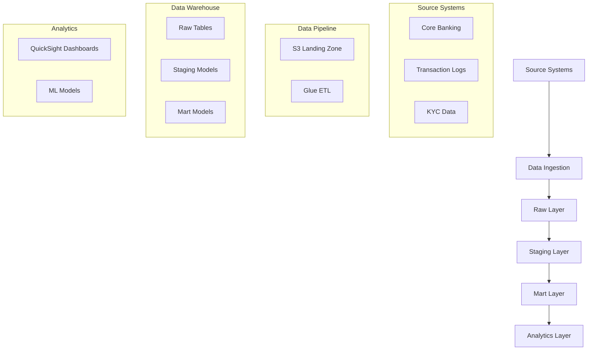

# FinTech Analytics Accelerator Architecture

## System Overview

The FinTech Analytics Accelerator is a comprehensive analytics solution built on AWS, leveraging dbt for data transformation, Amazon Redshift for data warehousing, and Amazon QuickSight for visualization.



## Component Details

### 1. Data Sources
- **Core Banking System**
  - Customer profiles
  - Account information
  - Transaction records
- **Transaction Logs**
  - Payment processing
  - ATM transactions
  - Online banking activities
- **KYC Data**
  - Customer verification
  - Risk assessment
  - Compliance information

### 2. Data Ingestion Layer
- **AWS S3 Landing Zone**
  - Raw data storage
  - Data lake architecture
  - Partitioned by date and source
- **AWS Glue ETL**
  - Data extraction
  - Initial cleaning
  - Schema validation

### 3. Data Warehouse (Amazon Redshift)
- **Raw Layer**
  - Source-aligned tables
  - Minimal transformations
  - Historical tracking
- **Staging Layer**
  - Data cleaning
  - Type casting
  - Basic transformations
- **Mart Layer**
  - Business-aligned models
  - Aggregated metrics
  - Dimensional models

### 4. Data Transformation (dbt)
- **Models**
  - Staging models
  - Intermediate models
  - Mart models
- **Tests**
  - Schema tests
  - Custom tests
  - Data quality checks
- **Documentation**
  - Model documentation
  - Data dictionary
  - Lineage graphs

### 5. Analytics Layer
- **QuickSight Dashboards**
  - Security monitoring
  - Fraud detection
  - Customer analytics
  - Revenue analysis
- **ML Models**
  - Fraud prediction
  - Customer segmentation
  - Churn prediction

## Data Flow

1. **Data Ingestion**
   ```
   Source Systems → S3 Landing → Glue ETL → Raw Tables
   ```

2. **Data Transformation**
   ```
   Raw Tables → Staging Models → Mart Models
   ```

3. **Analytics Processing**
   ```
   Mart Models → QuickSight Datasets → Dashboards
   ```

## Security Architecture

### 1. Data Security
- Encryption at rest (AWS KMS)
- Encryption in transit (TLS)
- Column-level encryption for sensitive data
- Data masking for PII

### 2. Access Control
- IAM roles and policies
- Redshift user groups
- QuickSight permissions
- dbt access controls

### 3. Audit & Compliance
- CloudTrail logging
- Redshift audit logging
- Data access logging
- Compliance reporting

## Performance Optimization

### 1. Redshift Optimization
- Distribution keys
- Sort keys
- Compression encoding
- Vacuum and analyze

### 2. Query Optimization
- Materialized views
- Partitioning
- Clustering
- Query monitoring

### 3. ETL Optimization
- Incremental processing
- Parallel processing
- Resource allocation
- Job scheduling

## Monitoring & Maintenance

### 1. System Monitoring
- CloudWatch metrics
- Redshift performance
- ETL job status
- Data quality metrics

### 2. Maintenance Tasks
- Table optimization
- Statistics updates
- Data archival
- Backup procedures

## Deployment Architecture

### 1. Environments
- Development
- Staging
- Production

### 2. CI/CD Pipeline
- GitHub Actions
- dbt Cloud
- AWS CodePipeline
- Infrastructure as Code

### 3. Version Control
- dbt models
- SQL scripts
- Dashboard templates
- Configuration files

## Scalability & Reliability

### 1. Scalability
- Auto-scaling clusters
- Partitioned tables
- Parallel processing
- Resource optimization

### 2. Reliability
- High availability
- Disaster recovery
- Data backup
- Error handling

## Cost Optimization

### 1. Resource Management
- Cluster sizing
- Storage optimization
- Query optimization
- Usage monitoring

### 2. Cost Controls
- Budget alerts
- Resource tagging
- Usage tracking
- Cost allocation 