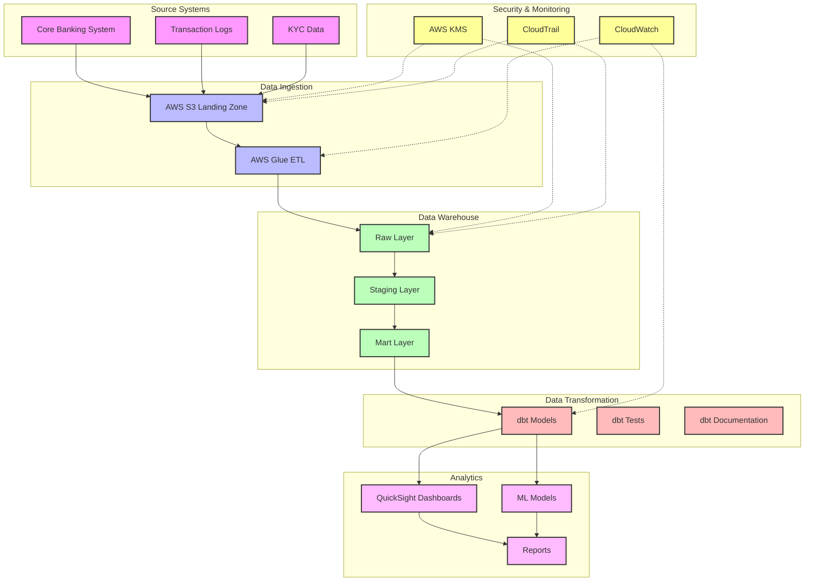

# FinTech Analytics Accelerator Architecture Diagram

## Component Details

### Source Systems
- **Core Banking System**: Customer accounts, transactions, and balances
- **Transaction Logs**: Payment processing and ATM transactions
- **KYC Data**: Customer verification and compliance information

### Data Ingestion
- **AWS S3 Landing Zone**: Raw data storage with partitioning
- **AWS Glue ETL**: Data extraction and initial transformation

### Data Warehouse
- **Raw Layer**: Source-aligned tables
- **Staging Layer**: Cleaned and transformed data
- **Mart Layer**: Business-aligned models

### Data Transformation
- **dbt Models**: SQL transformations and business logic
- **dbt Tests**: Data quality and integrity checks
- **dbt Documentation**: Model documentation and lineage

### Analytics
- **QuickSight Dashboards**: Interactive visualizations
- **ML Models**: Predictive analytics
- **Reports**: Scheduled and ad-hoc reporting

### Security & Monitoring
- **AWS KMS**: Encryption key management
- **CloudWatch**: Performance monitoring
- **CloudTrail**: Audit logging 